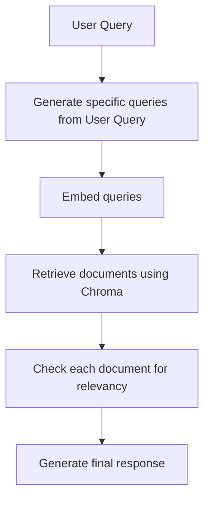

# Simple RAG agent for public SEC filings

This folder contains a simple RAG agent that uses data from public SEC filings by certain big tech companies.
The RAG is done on a per-document basis, and is summarized by the agent beforehand.
Retrieval is done by embeddings, and is reviewed for relevancy by the model before final generation.

each step roughly corresponds to a Python file:
- `rag.py` - REPL and queries
- `summarize.py` and `embed.py` - index documents' summaries
- `evaluate*` - Evaluate the agents based on KG-RAG's provided test cases and answers

## Dataset

The dataset used was selected to be/have:
- minimum restrictions on use (e.g. public domain)
- text-centric
- Q&A style (easy to evaluate)
  - Easy to check for accuracy and correctness
    - Example: Is it reading the correct parts of the text?

The following were considered:
- https://www.kaggle.com/datasets/rtatman/questionanswer-dataset
- https://github.com/docugami/KG-RAG-datasets/tree/main/sec-10-q
- https://www.kaggle.com/datasets/dkhundley/sample-rag-knowledge-item-dataset
- https://www.kaggle.com/datasets/samuelmatsuoharris/single-topic-rag-evaluation-dataset?select=single_passage_answer_questions.csv

KG-RAG was selected mainly for the transparency/provenance of the data source.
