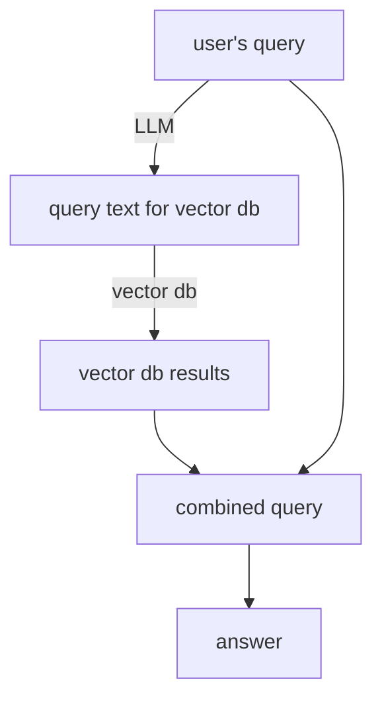

# Tutorial

This tutorial will walk you through making a simple RAG-based chatbot/agent using PACE ICE's compute resources.

Although this tutorial is applicable to many types of source datasets (i.e. data used as ground truths by the AI agent), we will follow along with an example that makes a chatbot/agent for public SEC filings.

## Prerequisites

- Python: basic knowledge (for loops, method calls, generators, etc)
- Bash: basic knowledge (for loops, variable substitution, etc)
- access to [PACE ICE's instance of Open OnDemand](https://ondemand-ice.pace.gatech.edu)
  - If off-campus, use the GT VPN (or in-browser VPN) to connect

## Step 1. Get Started with ICE

We are going to be running LLMs (large language models) on ICE.
The easiest way to get started with LLMs on ICE is to go to Open OnDemand, click "Interactive Apps" on the top navbar, and then "Ollama + Jupyter (Beta)."


Select "Temporary directory" as your Ollama models directory.
This directory is where the LLMs will be downloaded to. Since "PACE shared models" does not allow downloading additional models, we will use "Temporary directory" and download the models ourselves.
<!--  -->


For the node type, select "NVIDIA GPU (first avail)." This will ensure you get a GPU of some sort, while making sure you won't wait too long for a specific GPU to free up.

The default values can be used for everything else.

Once you click submit, you should see a card like the following:

This card will become green once the environment is ready:

Click "Connect to Jupyter" to open a new tab with your new environment.

## Step 2. Setting up your Environment

1. Clone this repository, and `cd` into it
2. Run `python -m venv venv` to setup a virtual enviroment, which will make installation Python packages easier.
3. Run `source venv/bin/activate` to activate the virtual environment. Now, commands like pip only affect this virtual environment, and should have no effect on your other projects (if any).
4. Run `pip install ollama nltk numpy chromadb`
  - `ollama` - used to run LLM models on ICE
  - `nltk` - used to divide the source text into sentences
  - `numpy` - convenient math subroutines
  - `chromadb` - simple vector database suited for prototyping (cf. [vector database comparison](https://github.com/gt-ospo/vsip-summer-2025-projects/blob/516848e0aef4465d0e666b573fa39767aa79d755/project-updates/ai-agent/Ken_Shibata.md#week-of-2025-jun-13))
5. (This will take a few ten minutes.) Run `python pull_models.py` to download a few models, so you can experiment and see which suits your use case the best.

## Step 3. Consider your Source Data

Listed below are a few questions to answer about your source dataset.

- What format is it in?
  - Examples: video, audio, PDF, plain text
- What format is the information in?
  - Is there a lot of template text (e.g. headers, legal notices)?
  - Is all data the same format (e.g. all plain text), or is there multiple (e.g. a graph and some text)

Based on anecdotal evidence, an LLM is more likely to hallucinate if given a *lot* of unnecessary information. Therefore, to make a good RAG chatbot, we want to give the LLM the minimum amount of information that still results in a good answer.

## Video/Image Data

See: `image_to_text.py`

The (current) modus operandi for ingesting video and image data is to also convert them into text, and then deal with them the usual way.
This section covers how to convert video and images into text.

On the more traditional side, [Tesseract](https://en.wikipedia.org/wiki/Tesseract_(software)) is a longstanding OCR (optical character recognition) library, and consistently converts images to text.
However, Tesseract's quality is not the best, and there are simply not many good open-source (non-AI) methods to convert images to text.

On the AI side, there are a couple of approaches: a) multimodal (read: images) embeddings, and b) using vision models to generate text.
The former is not actually implemented in `ollama` yet, so we will skip this method.
The latter is quite simple. You feed an image into a multimodal model, and ask it to describe the image. The output of that can then be treated as normal textual data.
A simple that does this is available as `image_to_text.py`, and can be used as follows:

Input: 
```
$ python image_to_text.py ./tech-tower.jpg 2> /dev/null
The image captures a detailed view of a red brick tower building with a slate-gray roof, framed by dark foliage against a brilliant blue sky.  Decorative elements adorn the building’s upper structure, showcasing a classic architectural style and conveying a sense of historical grandeur.
```
The model unfortunately does not know about Tech Tower, but it is pretty useful nonetheless.
This text can now be handled just like text.

## Audio Data

Similarly to video and image data, audio data is also mainly processed by first converting it to text. Although Ollama does not have support for transcribing audio, we can use other open-source packages including OpenAI's [whisper](https://github.com/openai/whisper).
The following command transcribes `audio.mp3` to text:
```
pip install whisper
whisper audio.mp3
```

Note that you can [speed up processing (and save money if using an API) by speeding up the audio itself](https://george.mand.is/2025/06/openai-charges-by-the-minute-so-make-the-minutes-shorter/).

## Textual Data

See: `summarize.py`

This is the simplest type of data to use, since LLMs operate on text. In a way, it is the most "native" format that humans can also understand.

Textual data may come in many different forms, such as Word documents, PDFs, and plain text files.
Since plain text is the best for LLMs, we focus on approaches that convert PDFs, Word documents, etc into plain text.
pdftotext(1) does a fine job copying out the textual portions of a PDF. However, it will miss figures/graphs and their representations (although these *should* have descriptive alternative text, which is often the best) and "image-only" PDFs, which are often generated by scanning a real book. These PDFs often do not contain any text, but are made of images strung together.

If your text is too long, you can get the LLM to summarize it for you - this can be done with a single use:
```python
summary = ollama.generate(
    model="llama3.2:3b",
    prompt=f"Make a short self-contained summary of the following text from {text_path} in Markdown: {chunk}\n\n If there is not much to say, just leave it blank. Make sure the summary is in Markdown and is easy to understand.",
)["response"]
```
Note that specific lengths, like "one paragraph" or "200 words" do not work well with LLMs (probably due to them working with tokens, not words).
Words such as "short" or "concise" work well in this context.

Once we have some kind of text (from PDFs, audio or video), we need to store it, so the AI agent can actually use it.

## Step 4. Consider how to Partition and Retrieve your Source Data

This section concerns the "retrieval" part of RAG.

Retrieval is all about taking the input query, and returning relevant documents that help answer the original query.
```
retrieval(inputQuery: str) -> List[Document]
```
We will cover two approaches to retrieving documents

### Vector Database

See: `rag.py`

The following is the simplified type signature of a vector database.
```
vector_db_store(id: str, vector: List[int])
vector_db_query(vector: List[int]) -> List[Document]
embed(text: str) -> List[int]
```

A vector database can be used to quickly store and retrieve text by its embedding vector.
This vector is generated by an embedding model like `nomic-embed-text` from a piece of text.

For example, using a vector database to store pies would be like:
```
vector_db_store('pumpkin_pie', embed('pumpkin pie'))
vector_db_store('apple_pie', embed('apple pie'))
vector_db_store('elderberry_pie', embed('elderberry pie'))
```
Now, when a RAG agent wants to know about pumpkins, it can run `vector_db_query(embed('pumpkins'))`, which would return `'pumpkin_pie'` as the top result.

A typical RAG agent (and the example agent in `rag.py`) use the following flowchart to process queries.


#### Picking a Vector Database

Below is a table of open source vector databases, with their strengths and features.
**For prototyping, Chroma and Faiss are good candidates.**
However, Chroma has an easy-to-use Python API (see `rag.py`), which makes it especially suitable for this tutorial.

| Feature                | **Chroma**                    | **Weaviate**                       | **Faiss**                            | **Qdrant**                      | **Milvus**                          | **pgvector**                     |
| ---------------------- | ----------------------------- | ---------------------------------- | ------------------------------------ | ------------------------------- | ----------------------------------- | -------------------------------- |
| **Type**               | Open-source library           | Open-source with managed option    | Library (C++ with Python bindings)   | Open-source with managed option | Open-source with managed option     | PostgreSQL extension             |
| **Language**           | Python                        | Go, Python, REST                   | C++, Python                          | Rust, REST, gRPC                | C++, Python, REST                   | SQL (PostgreSQL)                 |
| **Indexing**           | HNSW                          | HNSW + ANN options                 | IVF, PQ, HNSW, Flat                  | HNSW, IVF, Brute-force          | IVF, HNSW, ANNOY, Flat              | IVFFlat, HNSW, L2, cosine        |
| **Persistent storage** | Yes (local)                   | Yes (on-disk + cloud)              | No (requires external persistence)   | Yes                             | Yes                                 | Yes (native PostgreSQL)          |
| **Hybrid search**      | Yes (limited)                 | Yes (vector + structured, GraphQL) | No (vector only)                     | Yes (vector + metadata filters) | Yes (vector + scalar + boolean)     | Yes (via SQL WHERE)              |
| **Cloud-native**       | No                            | Yes (Weaviate Cloud)               | No                                   | Yes (Qdrant Cloud)              | Yes (Zilliz Cloud)                  | No                               |
| **Scalability**        | Limited                       | High (distributed)                 | Manual (not distributed)             | High (horizontal & distributed) | Very high (distributed & scalable)  | Moderate (limited by PostgreSQL) |
| **Use Case**           | Lightweight apps, prototyping | Enterprise-grade semantic search   | Research, offline/vector search only | Production-grade hybrid search  | Very large-scale AI/ML applications | Apps already using PostgreSQL    |
| **License**            | Apache 2.0                    | Proprietary                        | MIT                                  | Apache 2.0                      | Proprietary                         | PostgreSQL license               |

### Plain Text

A simple and surprisingly adequate tool is "normal" searching, where we just return documents that match the words in the input query.
The implementation is trivial, but results in many extraneous documents being output.
For example, the example RAG agent in this tutorial performed worse when returning the entirely of documents that matched any aspect of the content. Using chunking, the score was 55/195, and returning the whole document resulted in 44/195 (Llama 3.3).
